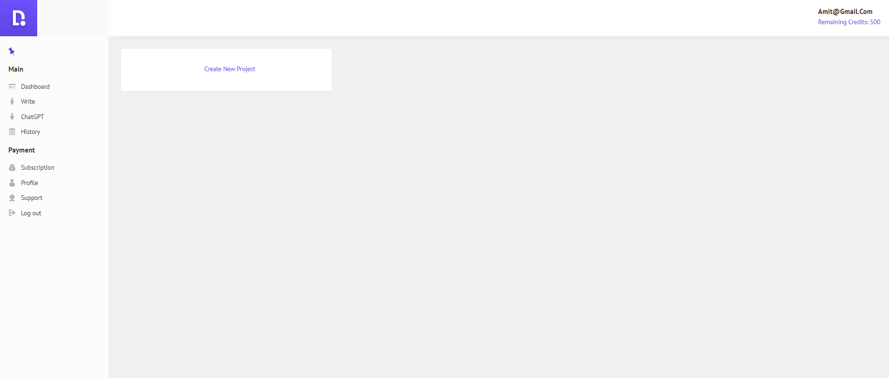
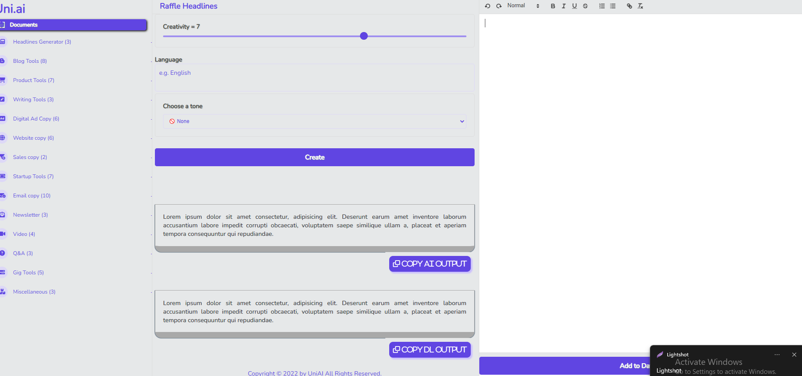
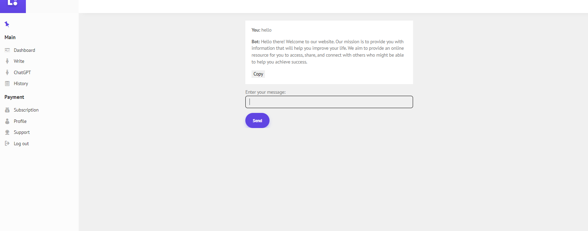
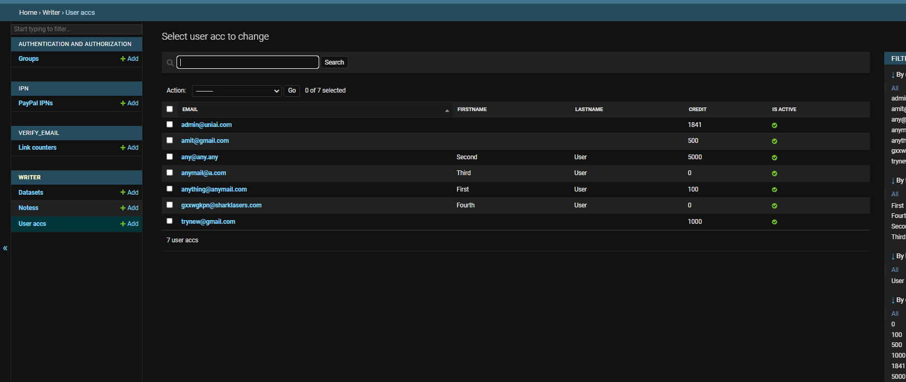
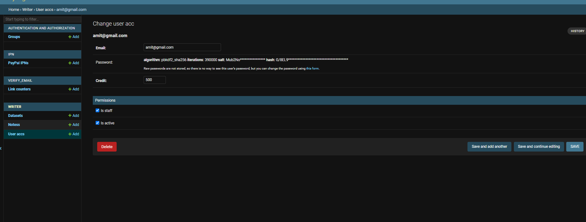
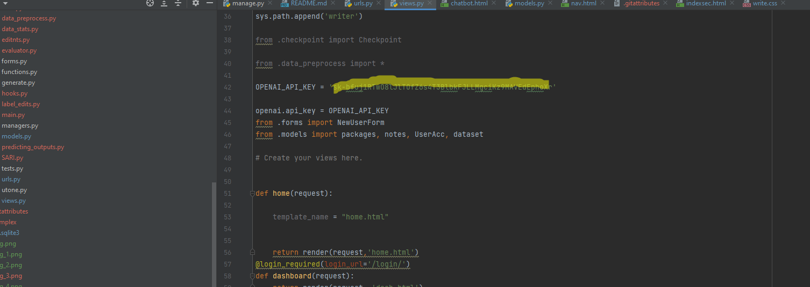
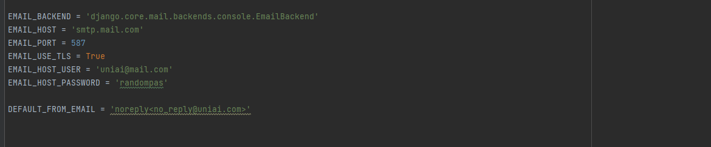

<h1> Hello, Welcome to the largest Deeplearning based GPT3 Writing tool in the web</h1>

<h3> There are two parts of this Ai writing assistant </h3>
<li> GPT3 Generated Text</li>
<li> Refine that using Deep Learning Model</li>
 

<strong> Currently it is using the latest GPT3 engines to generate the best quality output.</strong>

**For GPT3 Model**

you can use http//127.0.0.1:8000/login to get into the site... 

And you will land in this dashboard... 

`https://prnt.sc/lHU8sxyZX-K9`

Here are two options that you mainly need... 

<li> Write</li>
<li> ChatGPT</li>

<h2> Write </h2>
<strong> Here is all the functions that you are looking</strong>

You know how everything is happening here... 
However there are two output fields

 
First one is for AI output which come from GPT3

And then Deeplearing refined version... 

<h3> You can click on <strong style="color: green;"> Add To Dataset</strong> Button to use output for DL training.</h3>

<h2> ChatGPT </h2>

This is how you can chat with the ChatGPT

<h2>**Additionally** </h2>
<li> I have added Payment module that you can work in future as a SaaS model</li>
<li> Created profile page</li>

<h1> What Can You Do in Admin Panel? </h1>

<li> Add new user manually</li>
<li> Provide credit to user (discussed later)</li>
<li> Delete User and Make Admin</li>

<h2> Provide Credit To User</h2>

For example, you have 10 users or staff under you. And you don't want them to generate billions of words per month. 

So, Here you can add credits to the users. 1 credits = 1 words. Therefore, there will be always control in your hand. 

Also there are other default functions of Django Admin panel that you are familiar. 

 <h1> How To Run This Application?</h1>

After cloning the Git using Git clone command.Go to the project directory. 

Before continue further, please install Python or your server or computer. 

Then, activate Virtual environment...

Now command line: pip install -r requirements.txt

And then: python manage.py runserver

**Note: If you know how to run a django application, this is no different. 
Also, you can use Ubuntu or Other server to deploy it on the live server.** 

_Alternatively, email me here: amitbasunia8@gmail.com to assist you to deploy it on server._

<h1> Important changes that you may need to apply in future</h1>

**Change OPENAI APIKEY from writer/views.py** 

And if you want to change SMTP data

Change it from uniai/settings.py 

<h1> Details about Deep Learning Model</h1>

The model consists
of a programmer and an interpreter that operate
alternately at each time step: the programmer predicts a simplifying edit operation (program) such
as ADD, DELETE, or KEEP; the interpreter executes the edit operation while maintaining a context and an edit pointer to assist the programmer
for further decisions.

The simplification process as executing a sequence of edit operations on complex
tokens monotonically. We define the edit operations as {ADD(W), KEEP, DELETE, STOP}. Similar to the sequence-to-sequence learning models,
we assume a fixed-sized vocabulary of V words
that can be added. Therefore, the number of prediction candidates of the programmer is V + 3
after including KEEP, DELETE, and STOP. 

The programmer employs an
encoder-decoder structure to generate programs;
i.e., sequences of edit operations z. An encoder
transforms the input sentence
x = x1, . . .x|x|
into a sequence of latent representations h
enc
. We
additionally utilize the part-of-speech (POS) tags
g = g1, . . . g|x|
to inject the syntactic information
of sentences into the latent representations.

Thank You For Reading 
Amit Basunia 
I hope it is going to help you in your business. 
